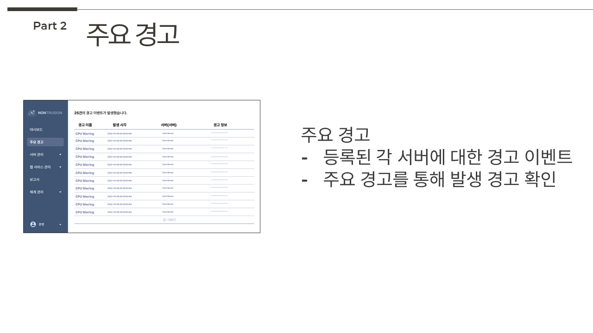

# 국방정보체계 모니터링 플랫폼,<br>**"NonTrusion"**


  
<a href='https://github.com/osamhack2022/WEB_CLOUD_WATCHCON/blob/main/license.md'>
  
</a>


## 프로젝트 소개

> 군대에는 여러 많은 정보체계 및 서비스들이 존재합니다. 이러한 정보체계, 서비스를 이용하다보면 404, 500, 에러페이지 등.. 갑작스럽게 정보체계 및 서비스들을 사용하지 못하게 되는 경우가 종종 발생합니다.
>
> 위와 같이 정보체계나 서비스에 장애가 발생하면, 보통은 부대 내 체계 관련 부서에서 이를 인지하고 조치를 하거나, 사용자에게 연락을 받은 뒤, 장애를 인지하고 해결하고 있는 상황입니다.
>
> 단, 위의 경우 해당 부대에서 관리하고 있는 체계의 경우, 부서 내에서 대응이 가능한 경우가 있지만, 다수의 경우 상위 기관에서 관리하고 있는 정보체계 & 서비스인 것으로 확인되어, 추가적으로 관련 부서에 연락을 하고 무슨 장애가 발생했는지 확인한 후 사용자에게 전파하게 됩니다. 또한, 관련 부서에서 24시간 관제 및 주기적으로 확인을 하면서 장애에 대응하고 있긴 하나, 놓치는 경우도 종종 발생하여 사용자의 신고로 인해 장애가 인지되는 경우도 종종 발생합니다.
>
> 그러다 보니, 체계 관련 부서는 장애 대응 및 이를 확인하는 과정에서 많은 애로사항을 가지고 있으며, 사용자의 입장에서도 자신의 PC가 문제인지, 정보체계 혹은 서비스에서 문제가 발생한 것인지 확인하는 것에 어려움을 겪고 있는 상황입니다.
>
> 위와 같은 이유들을 들어, 이번 국방오픈소스아카데미(OSAM) 해커톤에서 정보체계 및 서비스 장애를 빠르게 인지하고, 장애가 발생할 수 있는 위험들을 빠르게 식별 및 조치할 수 있도록 돕는 "NonTrusion"을 제작하게 되었습니다. 

## 기능 설명
**NonTrusion**의 주요기능은 아래와 같습니다.
- 서버 (모니터링)
- 웹 서비스 (모니터링)
- 주요 경고 (Trigger)
- 보고서 

### 서버 


### 웹 서비스


### 주요 경고 


### 보고서 


### 대시보드 


### 체계 관리


### 초기 설정


## 컴퓨터 구성 / 필수 조건 안내 (Prerequisites)
* ECMAScript 6 지원 브라우저 사용
* 권장: Google Chrome 버젼 77 이상

## 기술 스택 (Technique Used) 

### Front-end


### Server(back-end)


## 설치 안내 (Installation Process)
```bash
$ git clone git주소
$ yarn or npm install
$ yarn start or npm run start
```

## 프로젝트 사용법 (Getting Started)


위 화면에서 초기 설정 진행 후..


NonTrusion에 오신 걸 환영합니다 :D

 
## 팀 정보 (Team Information)


|        **역할** | **이름** |                   **Github**                   |
|----------------:|:--------:|:----------------------------------------------|
|   **Leader**, Backend |  이창엽  |     [@YeoPEVA](https://github.com/YeoPEVA)     |
| Design, Backend |  정준영  | [@jeongjy0317](https://github.com/jeongjy0317) |
|       Server |  이진우  |    [@Solrukas](https://github.com/Solrukas)    |
|        Frontend |  나영언  |  [@young-yeon](https://github.com/young-yeon)  |
|        Frontend |  정지용  |    [@camp5803](https://github.com/camp5803)    |

## 저작권 및 사용권 정보 (Copyleft / End User License)
 * [GPL 2.0](https://github.com/osamhack2022/WEB_CLOUD_WATCHCON/blob/main/license.md)

This project is licensed under the terms of the GPL 2.0 license.

